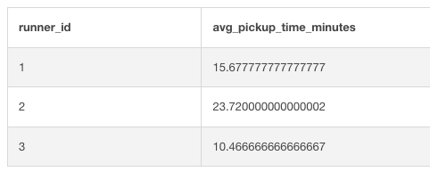

## B. Runner and Customer Experience
1. How many runners signed up for each 1 week period? (i.e. week starts 2021-01-01)
2. What was the average time in minutes it took for each runner to arrive at the Pizza Runner HQ to pickup the order?
3. Is there any relationship between the number of pizzas and how long the order takes to prepare?
4. What was the average distance travelled for each customer?
5. What was the difference between the longest and shortest delivery times for all orders?
6. What was the average speed for each runner for each delivery and do you notice any trend for these values?
7. What is the successful delivery percentage for each runner?


## 1. How many runners signed up for each 1 week period? (i.e. week starts 2021-01-01)

---
**solution 1**

    SELECT 
    	
        EXTRACT (week from registration_date) as week,
    	COUNT(runner_id) as runner_count
    FROM Runners
    group by 1;

| week | runner_count |
| ---- | ------------ |
| 53   | 2            |
| 1    | 1            |
| 2    | 1            |

---
this solution came from AI to address the week 53 solution related to the ISO standards build into the calendar i
**solution 2**

'''sql
    WITH week_starts AS (
      SELECT 
        generate_series(
          DATE '2021-01-01',
          (SELECT MAX(registration_date) FROM runners),
          '7 days'::interval
        ) AS week_start,
        ROW_NUMBER() OVER (ORDER BY generate_series(
          DATE '2021-01-01',
          (SELECT MAX(registration_date) FROM runners),
          '7 days'::interval
        )) AS week_number
    )
    SELECT 
      'Week ' || ws.week_number AS week_label,
      ws.week_start,
      ws.week_start + INTERVAL '6 days' AS week_end,
      COUNT(r.runner_id) AS runners_count
    FROM 
      week_starts ws
    LEFT JOIN 
      runners r ON r.registration_date >= ws.week_start 
               AND r.registration_date < ws.week_start + INTERVAL '7 days'
    GROUP BY 
      ws.week_number, ws.week_start
    ORDER BY 
      ws.week_start;
'''

| week_label | week_start               | week_end                 | runners_count |
| ---------- | ------------------------ | ------------------------ | ------------- |
| Week 1     | 2021-01-01T00:00:00.000Z | 2021-01-07T00:00:00.000Z | 2             |
| Week 2     | 2021-01-08T00:00:00.000Z | 2021-01-14T00:00:00.000Z | 1             |
| Week 3     | 2021-01-15T00:00:00.000Z | 2021-01-21T00:00:00.000Z | 1             |

---

## 2. What was the average time in minutes it took for each runner to arrive at the Pizza Runner HQ to pickup the order?

to solve we removed rows with no pickup time (to account for canceled orders). We also had to case pickup time to timestamp in order to use it in a calculation with order_time to extract the amount of minutes between order_time and pickup_time.
epoch extract the seconds which we then divided by 60 to covert minutes

'''sql
SELECT 
    r.runner_id,
    AVG(EXTRACT(EPOCH FROM (r.pickup_time::timestamp - c.order_time)) / 60) AS avg_pickup_time_minutes
FROM 
    customer_orders c
    JOIN temp_runner_orders r ON c.order_id = r.order_id
WHERE 
    r.pickup_time IS NOT NULL
GROUP BY 
    r.runner_id
ORDER BY 
    r.runner_id
'''

**solution**

runner_id	avg_pickup_time_minutes
1	15.677777777777777
2	23.720000000000002
3	10.466666666666667



## 3. Is there any relationship between the number of pizzas and how long the order takes to prepare?

To solve this we first extracted time it took from order time to pickup time using epoch which extracts seconds and then divided by 60 to get minues. Next we performed the aggregate count to count the number of pizza per order and of course grouped by our aggregate column order_id.

```sql
SELECT
	c.order_id,
    EXTRACT(EPOCH FROM ((r.pickup_time::TIMESTAMP - c.order_time) / 60)) AS picked_up,
    COUNT (c.order_id) AS counted_pizza
FROM customer_orders c
JOIN temp_runner_orders r ON c.order_id = r.order_id
WHERE r.cancellation IS NULL
GROUP BY c.order_id, r.pickup_time, c.order_time
ORDER BY 3 DESC, 2 DESC
```

**solution**


| order_id | picked_up | counted_pizza |
| -------- | --------- | ------------- |
| 4        | 29.283333 | 3             |
| 3        | 21.233333 | 2             |
| 10       | 15.516667 | 2             |
| 8        | 20.483333 | 1             |
| 1        | 10.533333 | 1             |
| 5        | 10.466667 | 1             |
| 7        | 10.266667 | 1             |
| 2        | 10.033333 | 1             |

---

## 4. What was the average distance travelled for each customer?
---
First we have to caste the disctace as a numeric column in order to perform mathmatical function of average on it. For every aggregate we must perfor a group by in this case customer id to identify average distance for each customer. 

```sql
    SELECT
    	customer_id,
        round(AVG(distance:: NUMERIC),0) as avg_distance
        
    FROM customer_orders c
    JOIN temp_runner_orders r ON c.order_id = r.order_id
    where cancellation is NULL
    group by customer_id
    ;
```
**solution**

| customer_id | avg_distance |
| ----------- | ------------ |
| 101         | 20           |
| 102         | 17           |
| 105         | 25           |
| 104         | 10           |
| 103         | 23           |

---


## 5. What was the difference between the longest and shortest delivery times for all orders?


---
```sql
    SELECT
       MAX(duration::NUMERIC) - MIN(duration::NUMERIC) as max_min_duration_dif
    FROM customer_orders c
    JOIN temp_runner_orders r ON c.order_id = r.order_id
    WHERE cancellation IS NULL;
```

**solution** 

| max_min_duration_dif |
| -------------------- |
| 30                   |

---

## 6. What was the average speed for each runner for each delivery and do you notice any trend for these values?

we used distance (km traveled in a delvery) and duration (time in minutes from pickup to delivered) to calculate km per hour after casting each of these fields to numeric and dividing duration by 60 to covert minutes to hours and created a CTE with this new column.
To get the avg km per hour by runner we queried our new CTE using ave and group by runner and added min and max by runner as an extra.

```sql
    with KM_HR_CTE as 
    (
    select 
    	runner_id,
        order_id,
    	round(
          distance::numeric / (duration::numeric/60),2) 
        	as km_hr
    from temp_runner_orders
    where cancellation is null
    order by runner_id
    )
    
    select 
    	runner_id,
        min(km_hr) AS MAX_KM_HR,
        max(km_hr) AS MIN_KM_HR,
    	round (avg(km_hr), 2) AS AVG_KM_HR
    from 
    	KM_HR_CTE
    group by 1;
```

| runner_id | max_km_hr | min_km_hr | avg_km_hr |
| --------- | --------- | --------- | --------- |
| 1         | 37.50     | 60.00     | 45.54     |
| 2         | 35.10     | 93.60     | 62.90     |
| 3         | 40.00     | 40.00     | 40.00     |

---

